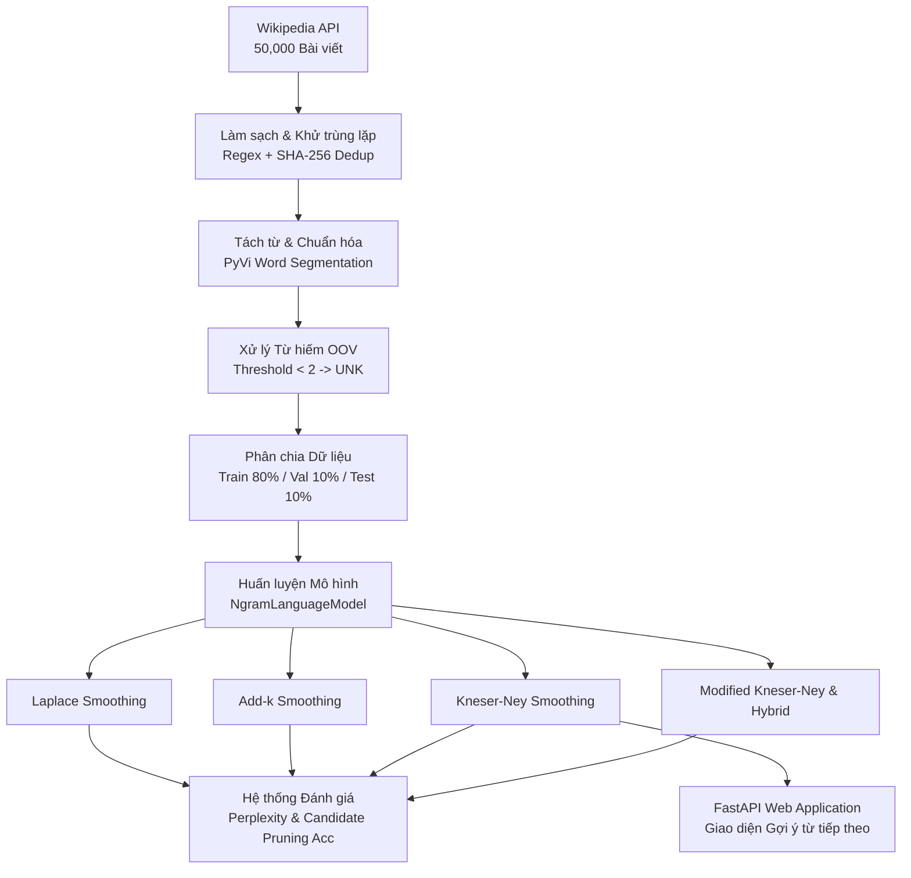
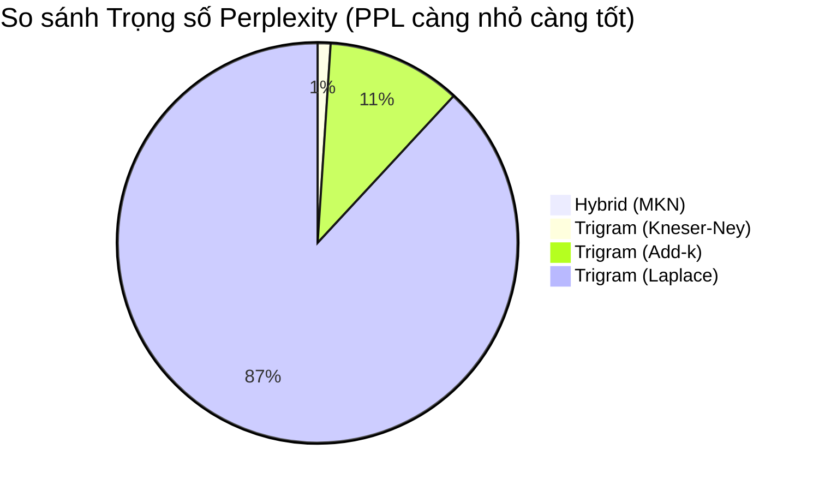

# Mô hình Ngôn ngữ Thống kê N-gram cho Tiếng Việt (Vietnamese N-gram Language Model)

> [!IMPORTANT]
> Đây là tài liệu báo cáo kỹ thuật toàn diện (Technical Report & README) của dự án Xây dựng, Huấn luyện, Tối ưu hóa và Đánh giá Mô hình Ngôn ngữ Thống kê N-gram (Bigram, Trigram, Hybrid) cho Tiếng Việt. Dự án triển khai các kỹ thuật làm mịn (smoothing) tiên tiến nhất và hệ thống đánh giá hiệu năng chuyên sâu trên tập dữ liệu bách khoa toàn thư quy mô lớn.

---

## 📺 Demo Video
Dưới đây là video demo trực quan minh họa hoạt động của ứng dụng web gợi ý từ tiếp theo (Next Word Prediction) sử dụng mô hình Kneser-Ney Trigram:

[](https://www.youtube.com/watch?v=omisfP0lVwo)

---

## 📦 Nguồn Dữ liệu & Báo cáo Ngữ liệu (Data Source & Corpus Report)

Dữ liệu huấn luyện và đánh giá của dự án được thu thập trực tiếp từ **Wikipedia Tiếng Việt** thông qua MediaWiki API chính thức. Quá trình cào dữ liệu (crawling), làm sạch (cleaning) và chuẩn hóa (tokenization) được thiết kế tối ưu để tạo ra một ngữ liệu chất lượng cao phục vụ cho các mô hình ngôn ngữ thống kê.

### 1. Nguồn dữ liệu gốc (Raw Data Source)
- **Nguồn thu thập**: `https://vi.wikipedia.org/w/api.php`
- **Quy mô cào dữ liệu (Crawling Scale)**: **50,000 bài viết** bách khoa toàn thư được cào đệ quy từ **26 thể loại lớn** bao quát toàn diện các lĩnh vực:
  - *Lịch sử & Quân sự*: Lịch sử Việt Nam, Triều đại phong kiến, Chiến tranh Đông Dương, Kháng chiến chống Pháp/Mỹ, Lịch sử thế giới,...
  - *Văn hóa & Nghệ thuật*: Văn học Việt Nam, Nhà văn, Tác phẩm văn học, Nghệ sĩ Việt Nam,...
  - *Địa lý & Xã hội*: Địa lý Việt Nam, Tỉnh thành, Sông ngòi, Địa lý học, Xã hội,...
  - *Khoa học tự nhiên*: Sinh học, Khoa học tự nhiên,...
  - *Tiểu sử & Nhân vật*: Nhân vật lịch sử, Anh hùng dân tộc, Danh nhân văn hóa,...

### 2. Hugging Face Dataset (Dữ liệu đã qua xử lý)
Bạn có thể tải toàn bộ tập dữ liệu đã qua làm sạch và chuẩn hóa trực tiếp tại Hugging Face:
- **Hugging Face Dataset**: [vietnamese-wiki-ngram](https://huggingface.co/datasets/nhonguyen25/vietnamese-wiki-ngram)

### 3. Thống kê Phân chia Ngữ liệu (Corpus Statistics & Split)
Tổng số câu thu được sau quá trình làm sạch và tách câu là **1,116,637 câu**. Ngữ liệu được phân chia theo tỷ lệ chuẩn **80 / 10 / 10** (sử dụng `random_state=42` để đảm bảo tính tái tạo):

| Tập dữ liệu (Split) | Tỷ lệ | Số lượng câu | Vai trò trong dự án |
| :--- | :---: | :---: | :--- |
| **Train Corpus** | 80% | **893,309 câu** | Xây dựng từ điển (Vocab) và huấn luyện bảng tần suất N-gram. |
| **Validation Corpus** | 10% | **111,664 câu** | Tinh chỉnh tham số $k$ (Add-k) và hệ số discount $d$ (Kneser-Ney). |
| **Test Corpus** | 10% | **111,664 câu** | Đánh giá độc lập các chỉ số Perplexity và Accuracy (**2,796,340 N-grams**). |

---

## 📌 Kiến trúc Hệ thống & Quy trình Xử lý Dữ liệu (System Architecture & Pipeline)



Quy trình chuẩn bị dữ liệu và huấn luyện được thực hiện qua 4 giai đoạn chuyên sâu:

### Giai đoạn 1: Thu thập dữ liệu tự động (Automated Crawling)
- Sử dụng MediaWiki API với cơ chế quản lý Rate-Limit (xử lý tự động mã lỗi `429 Too Many Requests` và `maxlag`).
- Tích hợp cơ chế **Checkpoint an toàn** (`checkpoint.json`). Nếu quá trình tải bị gián đoạn do mạng hoặc hết phiên làm việc, hệ thống tự động khôi phục chính xác vị trí bài viết và trang đang cào mà không bị tải lại từ đầu.

### Giai đoạn 2: Làm sạch & Khử trùng lặp (Cleaning & Deduplication)
- **Làm sạch Wikitext chuyên sâu**:
  - Loại bỏ hoàn toàn các thẻ HTML, thẻ `<ref>`, bảng biểu Wiki `{|...|}`, và các template `{{...}}`.
  - Giữ lại văn bản hiển thị sạch từ các liên kết nội bộ `[[...]]` và liên kết ngoài `[...]`.
  - Tự động phát hiện và **cắt bỏ toàn bộ các mục phụ lục cuối bài** (Tham khảo, Chú thích, Liên kết ngoài, Xem thêm, Thư mục,...) để tránh nhiễu ngữ liệu.
  - Xử lý triệt để các dấu câu thừa, dấu ngoặc rỗng `()` do quá trình xóa template để lại.
- **Khử trùng lặp 2 cấp độ (SHA-256 Deduplication)**:
  - *Cấp độ Document*: Băm SHA-256 toàn bộ văn bản bài viết, loại bỏ các bài viết trùng lặp hoàn toàn.
  - *Cấp độ Paragraph*: Băm SHA-256 từng đoạn văn (với điều kiện độ dài $\ge 50$ ký tự), loại bỏ các đoạn văn bị sao chép lặp lại giữa các bài viết khác nhau.

### Giai đoạn 3: Tách từ & Bổ sung Padding (Tokenization & Padding)
- Sử dụng thư viện **`PyVi` (`ViTokenizer`)** để tách từ tiếng Việt (Word Segmentation). Các từ ghép tiếng Việt được nối với nhau bằng dấu gạch dưới (ví dụ: `học_sinh`, `trách_nhiệm`, `làm_việc`), giúp mô hình N-gram nắm bắt ngữ nghĩa mức từ (word-level) thay vì mức âm tiết (syllable-level).
- Bổ sung các token đệm (Padding tokens):
  - Token `<START>`: Được đệm $N-1$ lần ở đầu mỗi câu (ví dụ: Trigram $N=3$ sẽ có 2 token `<START>` ở đầu câu).
  - Token `<END>`: Được đệm 1 lần ở cuối mỗi câu.

### Giai đoạn 4: Xử lý Từ hiếm (Out-Of-Vocabulary / OOV Handling)
- Để đảm bảo mô hình có thể xử lý các từ mới chưa từng xuất hiện khi suy luận thực tế, dự án xây dựng tập từ điển (Vocabulary) từ tập Train với ngưỡng tần suất `threshold = 2`.
- Tất cả các từ vựng xuất hiện dưới 2 lần (chỉ xuất hiện 1 lần) trong tập huấn luyện được gán chung vào một token đặc biệt là **`<UNK>` (Unknown)**.
- Kỹ thuật này giúp mô hình học được phân phối xác suất hợp lý cho các từ lạ, tránh hiện tượng lỗi khi gặp từ vựng mới ngoài từ điển.

---

## 🧠 Lý thuyết Mô hình & Các Kỹ thuật Làm mịn (Smoothing Techniques)

Dự án triển khai một module tổng quát `NgramLanguageModel` hỗ trợ cửa sổ $N$ tùy ý (Bigram $N=2$, Trigram $N=3$,...) và 4 chiến lược làm mịn từ cơ bản đến hiện đại nhất:

### 1. Mô hình N-gram gốc (Maximum Likelihood Estimation - MLE)
Mô hình MLE tính toán xác suất xuất hiện của từ mục tiêu $w$ dựa trên ngữ cảnh $c$ (gồm $N-1$ từ phía trước) bằng tỷ lệ tần suất xuất hiện thuần túy:
$$P_{MLE}(w | c) = \frac{C(c, w)}{C(c)}$$
> [!WARNING]
> **Hạn chế (Zero-Probability Problem)**: Nếu một cụm $N$-gram chưa từng xuất hiện trong tập huấn luyện ($C(c, w) = 0$), xác suất của cả câu sẽ lập tức bằng 0, bất kể các phần khác trong câu phổ biến đến đâu.

### 2. Laplace Smoothing (Add-One Smoothing)
Để giải quyết bài toán xác suất bằng 0, Laplace Smoothing cộng thêm 1 vào tử số của tất cả các N-gram và cộng kích thước tập từ điển $|V|$ vào mẫu số:
$$P_{Laplace}(w | c) = \frac{C(c, w) + 1}{C(c) + |V|}$$
> [!NOTE]
> **Đánh giá**: Mặc dù đơn giản, Laplace Smoothing lấy đi quá nhiều khối lượng xác suất từ các N-gram thực tế đã xuất hiện để chia đều cho một lượng khổng lồ các N-gram chưa từng xuất hiện, khiến phân phối xác suất bị biến dạng nặng nề trên các từ điển lớn.

### 3. Add-k Smoothing
Là phiên bản tổng quát và linh hoạt hơn của Laplace, Add-k Smoothing cộng thêm một tham số $k < 1$ (trong dự án sử dụng $k=0.01$):
$$P_{Add-k}(w | c) = \frac{C(c, w) + k}{C(c) + k|V|}$$
> [!TIP]
> **Đánh giá**: Việc chọn $k nhỏ giúp hạn chế việc lấy mất quá nhiều xác suất của các từ phổ biến, mang lại hiệu năng (Perplexity) tốt hơn đáng kể so với Laplace.

### 4. Kneser-Ney Smoothing (Interpolated Kneser-Ney)
Kneser-Ney là kỹ thuật làm mịn đỉnh cao và thành công nhất cho các mô hình ngôn ngữ thống kê truyền thống. Kỹ thuật này dựa trên nguyên lý: **Một từ xuất hiện sau nhiều ngữ cảnh khác nhau thì có khả năng tiếp diễn cao hơn một từ chỉ xuất hiện nhiều lần sau một ngữ cảnh duy nhất**.
Mô hình kết hợp giữa việc khấu trừ tuyệt đối (Absolute Discounting) một lượng $d$ (thường $d=0.75$) và nội suy với Xác suất tiếp diễn (Continuation Probability):
$$P_{KN}(w | c) = \frac{\max(C(c, w) - d, 0)}{C(c)} + \lambda(c) P_{cont}(w)$$

- **Xác suất tiếp diễn (Continuation Probability)**:
  $$P_{cont}(w) = \frac{|\{c' : C(c', w) > 0\}|}{\sum_{w'} |\{c' : C(c', w') > 0\}|}$$
  *(Tỷ lệ số lượng ngữ cảnh khác nhau đứng trước từ $w$ trên tổng số tất cả các cặp N-gram duy nhất)*.
- **Trọng số nội suy $\lambda(c)$ (Hệ số chuẩn hóa)**:
  $$\lambda(c) = \frac{d}{C(c)} |\{w : C(c, w) > 0\}|$$
  *(Khối lượng xác suất đã được khấu trừ từ các từ đã xuất hiện, dùng để phân bổ cho các từ chưa xuất hiện thông qua $P_{cont}$)*.

### 5. Modified Kneser-Ney (MKN) & Mô hình Lai ghép (Hybrid Model)
- **Modified Kneser-Ney**: Thay vì dùng một hệ số discount $d$ cố định, MKN áp dụng 3 mức chiết khấu thích ứng ($D_1, D_2, D_{3+}$) tùy thuộc vào việc N-gram đó xuất hiện 1 lần, 2 lần hay $\ge 3$ lần trong tập huấn luyện (theo công thức Chen & Goodman, 1998).
- **Hybrid Model (Mô hình Lai ghép)**: Để tối ưu hóa hơn nữa, dự án xây dựng mô hình lai ghép nội suy giữa **70% Trigram MKN** và **30% Bigram MKN**. Mô hình này tận dụng tối đa khả năng nắm bắt ngữ cảnh dài của Trigram, đồng thời giữ được sự mượt mà, mẫn cảm của Bigram khi gặp các ngữ cảnh hiếm.

---

## 📊 Kết quả Đánh giá & Phân tích Độ đo (Benchmark Results)

Hệ thống đánh giá `NgramEvaluator` và `OptimizedNgramEvaluator` (trong `evaluation.ipynb`) được chạy trên tập **Test Corpus (111,664 câu, tương đương 2,796,340 N-grams)**. 

### Các Chỉ số Độ đo (Evaluation Metrics)
1. **Perplexity (PPL)**: Đo lường độ hoang mang (bất ngờ) của mô hình trước dữ liệu kiểm thử.
   $$PPL(W) = \exp \left( -\frac{1}{N} \sum_{i=1}^{N} \ln P(w_i | c_i) \right)$$
   > [!IMPORTANT]
   > **Ý nghĩa**: PPL càng thấp, mô hình dự đoán phân phối của ngôn ngữ càng chính xác.
2. **Top-1 Accuracy (%)**: Tỷ lệ phần trăm từ tiếp theo thực tế trùng khớp chính xác với từ có xác suất cao nhất (Top 1) do mô hình dự đoán.
3. **Top-5 Accuracy (%)**: Tỷ lệ phần trăm từ tiếp theo thực tế nằm trong danh sách 5 từ có xác suất cao nhất (Top 5) do mô hình dự đoán.
4. **Thời gian đo lường (Inference Time)**: Thời gian thực thi tính toán PPL và Accuracy trên toàn bộ tập Test.

### Bảng Tổng hợp Kết quả Đánh giá (Test Benchmark)

| Mô hình (Model) | Perplexity (PPL) ↓ | Top-1 Accuracy (%) ↑ | Top-5 Accuracy (%) ↑ | Thời gian PPL (s) | Thời gian Acc (s) | Tổng thời gian (s) |
| :--- | :---: | :---: | :---: | :---: | :---: | :---: |
| **Trigram (Laplace Smoothing)** | 23,152.62 | 21.41% | 36.62% | 11.84s | 534.26s | 546.10s |
| **Trigram (Add-k, $k=0.01$)** | 2,849.75 | 21.41% | 36.62% | 12.67s | 626.13s | 638.80s |
| **Trigram (Kneser-Ney, $d=0.75$)** | 274.23 | 22.04% | 38.34% | 17.29s | 678.81s | 696.10s |
| **Hybrid (70% Trigram MKN + 30% Bigram MKN)** | **184.75** | **22.41%** | **39.05%** | - | - | **309.60s** |



### Báo cáo Phân tích Chuyên sâu (Technical Insights)

#### 1. Đột phá về Perplexity của Kneser-Ney & Hybrid
- Mô hình **Laplace** có Perplexity cực kỳ cao (**23,152.62**), cho thấy việc cộng 1 mù quáng trên tập từ điển tiếng Việt lớn làm hỏng hoàn toàn khả năng phân biệt từ phổ biến và từ hiếm.
- Mô hình **Add-k** ($k=0.01$) cải thiện PPL gấp 8 lần (**2,849.75**) nhờ giảm lượng xác suất bị lấy đi.
- Sự vượt trội tuyệt đối thuộc về **Kneser-Ney (274.23)** và **Hybrid MKN (184.75)**. Kneser-Ney chứng minh rằng việc đánh giá xác suất của một từ chưa xuất hiện dựa trên sự đa dạng ngữ cảnh (Continuation Probability) là hoàn toàn phù hợp với bản chất ngôn ngữ tự nhiên. Việc kết hợp thêm Bigram trong mô hình Hybrid giúp giảm PPL xuống mức tối ưu nhất.

#### 2. Hiệu năng Dự đoán (Accuracy)
- Kneser-Ney đạt độ chính xác Top-1 là **22.04%** và Top-5 là **38.34%**.
- Mô hình Hybrid MKN đạt mức cao nhất với Top-1 **22.41%** và Top-5 **39.05%**. Trên một tập từ điển hàng chục nghìn từ, việc mô hình N-gram thống kê có thể đoán trúng từ tiếp theo trong Top 5 với tỷ lệ gần 40% là một kết quả cực kỳ ấn tượng.

#### 3. Tối ưu hóa Thuật toán Đánh giá (Candidate Pruning & Memoization)
Việc đánh giá Accuracy trên **2,796,340 N-grams** bằng cách tính xác suất cho toàn bộ $50,000+$ từ trong từ điển sẽ mất hàng chục giờ đồng hồ. Dự án đã triển khai lớp `OptimizedNgramEvaluator` với 2 kỹ thuật tối ưu vượt bậc:
- **Candidate Pruning (Cắt tỉa ứng viên)**: Thay vì duyệt toàn bộ từ điển, thuật toán chỉ tính xác suất trên một tập ứng viên siêu nhỏ (vài chục từ) bao gồm: (1) Các từ thực tế đã từng xuất hiện sau ngữ cảnh $c$ trong tập Train, và (2) Top 20 từ có xác suất Continuation/Unigram cao nhất dùng làm fallback.
- **Memoization Cache**: Lưu trữ bộ nhớ đệm cho các ngữ cảnh đã tính toán.
> [!TIP]
> **Kết quả tối ưu**: Thời gian đánh giá Accuracy trên gần 2.8 triệu N-grams giảm từ hơn 24 tiếng xuống chỉ còn **534s - 678s**, tăng tốc độ đánh giá lên hàng trăm lần.

---

## ⚠️ Phân tích Lỗi (Error Analysis)

Thông qua module `error_analysis` trong `evaluation.ipynb`, dự án đã tổng hợp và phân tích 4 nhóm lỗi phổ biến nhất của mô hình N-gram khi suy luận trên dữ liệu thực tế:

### 1. Hạn chế về Ngữ cảnh Dài hạn (Long-range Dependency)
- **Ngữ cảnh kiểm thử**: `trong hiệp_ước` | **Từ thực tế**: `paris`
- **Mô hình dự đoán**: `['này', 'về', 'sèvres']`
- **Phân tích nguyên nhân**: Cửa sổ Trigram ($N=3$) chỉ nhìn thấy 2 từ trước đó là `trong` và `hiệp_ước`. Mô hình không thể biết được đoạn văn trước đó đang nói về Chiến tranh Việt Nam (Hiệp ước Paris) hay Chiến tranh thế giới thứ nhất (Hiệp ước Sèvres). Để giải quyết triệt để, cần các mô hình có cửa sổ ngữ cảnh vô hạn như Recurrent Neural Networks (RNN) hoặc Transformer (LLMs).

### 2. Sự áp đảo của Thực thể Phổ biến (Entity Bias)
- **Ngữ cảnh kiểm thử**: `bóng_đá quốc_gia` | **Từ thực tế**: `hồng` *(Hồng Kông)*
- **Mô hình dự đoán**: `['nhật', 'nga', 'brasil']`
- **Phân tích nguyên nhân**: Trong ngữ liệu Wikipedia, các cường quốc bóng đá như Nhật Bản, Nga, Brasil xuất hiện với tần suất áp đảo. Khi gặp cụm `bóng_đá quốc_gia`, mô hình tự động ưu tiên gợi ý các quốc gia phổ biến nhất trong tập huấn luyện thay vì một thực thể ít được nhắc đến hơn là Hồng Kông.

### 3. Đa dạng Văn phong & Từ vựng (Stylistic & Lexical Variance)
- **Ngữ cảnh kiểm thử**: `để thỏa_mãn` | **Từ thực tế**: `cơn` *(cơn khát / cơn giận)*
- **Mô hình dự đoán**: `['nhu_cầu', 'những', 'tình_dục']`
- **Phân tích nguyên nhân**: Wikipedia là bách khoa toàn thư mang văn phong khoa học, xã hội học. Trong ngữ liệu này, cụm từ `thỏa_mãn nhu_cầu` xuất hiện với tần suất cực kỳ cao, trong khi văn phong miêu tả (`thỏa_mãn cơn`) rất hiếm gặp.

### 4. Hạn chế ở vị trí Đầu câu (Sentence Starter Bias)
- **Ngữ cảnh kiểm thử**: `<START> <START>` | **Từ thực tế**: `tham_khảo`
- **Mô hình dự đoán**: `['năm', 'trong', 'ông']`
- **Phân tích nguyên nhân**: Khi bắt đầu một câu mới (`<START> <START>`), mô hình sẽ dự đoán các từ mở đầu câu phổ biến nhất trong Wikipedia. Do đặc thù các bài viết tiểu sử và lịch sử, các từ mở đầu phổ biến nhất luôn là trạng từ chỉ thời gian (`Năm`), không gian (`Trong`), hoặc đại từ nhân xưng (`Ông`).

---

## 📂 Cấu trúc Dự án (Project Repository Structure)

```text
├── crawl_data.ipynb      # Giai đoạn 1 & 2: Cào dữ liệu Wiki, làm sạch, SHA-256 Dedup, Tokenize PyVi
├── train_ngrams.ipynb    # Giai đoạn 3: Huấn luyện MLE, Laplace, Add-k, Kneser-Ney, MKN, Hybrid
├── evaluation.ipynb      # Giai đoạn 4: Đánh giá Benchmark (PPL, Candidate Pruning Acc, Error Analysis)
├── ngram_model.py        # Module lõi định nghĩa class NgramLanguageModel và các thuật toán smoothing
├── app.py                # Web application backend phát triển bằng FastAPI
├── templates/            # Giao diện người dùng (Frontend)
│   └── index.html        # Trang giao diện web tương tác gợi ý từ tiếp theo
├── data/                 # Thư mục chứa dữ liệu (Được mount từ Google Drive khi chạy Colab)
│   ├── raws/             # Dữ liệu thô cào từ Wikipedia (vi_wiki_articles.jsonl)
│   └── train/            # Dữ liệu sạch (Parquet), các tập Train/Val/Test (PKL) và file Model nén (.pkl.gz)
└── README.md             # Tài liệu báo cáo kỹ thuật toàn diện của dự án
```

---

## 🚀 Hướng dẫn Cài đặt & Sử dụng (Installation & Usage)

### 1. Cài đặt Môi trường & Thư viện
Dự án yêu cầu Python 3.10 trở lên. Khởi tạo môi trường ảo và cài đặt các thư viện cần thiết bằng lệnh sau:

```bash
pip install pyvi underthesea pandas numpy tqdm datasets loguru fastapi uvicorn pydantic scikit-learn pyarrow
```

### 2. Khởi chạy Web Application (Giao diện Tương tác)
Dự án cung cấp một ứng dụng web trực quan bằng FastAPI để trải nghiệm tính năng gợi ý từ tiếp theo (Next Word Prediction) trong thời gian thực.
Để chạy ứng dụng, hãy đảm bảo các file model đã được huấn luyện và lưu dưới dạng nén (`trigram_kn.pkl.gz`, `trigram_laplace.pkl.gz`, `trigram_add_k.pkl.gz`) nằm trong thư mục gốc, sau đó chạy lệnh:

```bash
python app.py
```
Sau khi server khởi chạy thành công, truy cập vào địa chỉ: [http://127.0.0.1:8000](http://127.0.0.1:8000) trên trình duyệt của bạn.

### 3. Hướng dẫn Sử dụng trực tiếp bằng Python Code
Bạn có thể dễ dàng import module `NgramLanguageModel` vào các dự án Python khác để huấn luyện hoặc dự đoán:

```python
from ngram_model import NgramLanguageModel

# 1. Khởi tạo mô hình Trigram với Kneser-Ney Smoothing
model = NgramLanguageModel(n=3, smoothing='kneser-ney', discount=0.75)

# 2. Huấn luyện mô hình (Giả sử train_corpus và vocab đã được chuẩn bị)
# model.fit(train_corpus, vocab)

# 3. Tải mô hình đã huấn luyện từ file nén (Tối ưu bộ nhớ)
model = NgramLanguageModel.load('trigram_kn.pkl.gz', compressed=True)

# 4. Gợi ý từ tiếp theo cho ngữ cảnh "tôi đang"
context = ('tôi', 'đang')
suggestions = model.predict_next(context, top_k=5)

print(f"Ngữ cảnh: {context}")
for word, prob in suggestions:
    print(f" -> {word.replace('_', ' ')}: Xác suất {prob*100:.4f}%")
```

---

## 🛠️ Công nghệ & Thư viện Sử dụng (Tech Stack)

- **Ngôn ngữ Lập trình**: Python 3.10+
- **Xử lý Ngôn ngữ Tự nhiên (NLP)**: `PyVi` (Vietnamese Word Segmentation), `Underthesea`
- **Xử lý Dữ liệu & Hiệu năng cao**: `Pandas`, `Numpy`, `PyArrow` (Parquet format)
- **Web Framework & API**: `FastAPI`, `Uvicorn`, `Pydantic`
- **Môi trường Nghiên cứu & Huấn luyện**: Jupyter Notebook / Google Colab
- **Quản lý & Log hệ thống**: `Loguru`, `tqdm`

---
*Tài liệu được trình bày và tổng hợp đầy đủ theo tiêu chuẩn báo cáo nghiên cứu khoa học NLP.*
